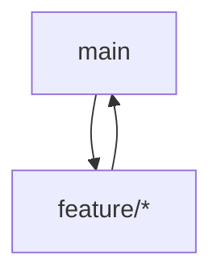

# 🤝 Contribuir al Proyecto

Para mantener una base de código limpia, segura y ordenada, seguimos una serie de buenas prácticas y reglas de colaboración. Por favor, **lee este documento antes de contribuir.**

---

## 🧭 Flujo de ramas



### 📋 Estructura de ramas

- **`main`**: Rama estable para producción. Contiene el código listo para producción.
- **`feature/*`**: Nuevas funcionalidades y mejoras. Se crean desde `main` y se fusionan de vuelta a `main`.

### 🛡️ Reglas de ramas protegidas

- ❌ **No se permite hacer push directo** a `main`.
- ✅ Todos los cambios deben pasar por un **Pull Request (PR)**.
- ✅ Todo PR debe ser **revisado y aprobado** por al menos 1 miembro del equipo.
- ✅ Los PRs deben estar **actualizados** con la rama base antes de hacer merge.

---

## 📝 Convención de mensajes de commit

Usamos **Conventional Commits** para mantener claridad en el historial.

### Tipos de commit:

- `feat`: Nueva funcionalidad
- `fix`: Corrección de errores
- `docs`: Cambios en documentación
- `style`: Cambios que no afectan el código (espacios, formato, etc.)
- `refactor`: Refactorización de código
- `test`: Agregar o corregir pruebas
- `chore`: Cambios en build, configuraciones, etc.

### Ejemplos:

```bash
feat: agregar componente de navbar
fix: corregir error en la validación de email
refactor: mejorar estructura del componente de login
docs: actualizar README con nuevas instrucciones
test: agregar pruebas para el componente Button
chore: actualizar dependencias de desarrollo
```

---

Gracias por mantener el código limpio y el equipo alineado 💙

**¡Cada contribución, por pequeña que sea, hace una gran diferencia!**
