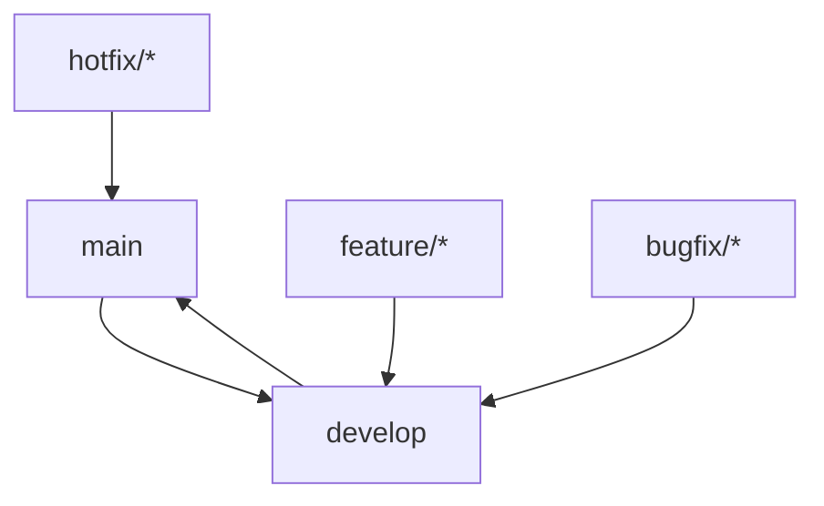

# 🤝 Contribuir al Proyecto

Para mantener una base de código limpia, segura y ordenada, seguimos una serie de buenas prácticas y reglas de colaboración. Por favor, **lee este documento antes de contribuir.**

---

## 🧭 Flujo de ramas



### 📋 Estructura de ramas

- **`main`**: Rama estable para producción. Solo acepta cambios desde `develop`.
- **`develop`**: Rama de integración continua. Todos los cambios deben pasar por aquí antes de llegar a `main`.
- **`feature/*`**: Nuevas funcionalidades.
- **`bugfix/*`**: Correcciones de errores no críticos.
- **`hotfix/*`**: Correcciones urgentes para `main`.

### 🛡️ Reglas de ramas protegidas

- ❌ **No se permite hacer push directo** a `main` ni a `develop`.
- ✅ Todos los cambios deben pasar por un **Pull Request (PR)**.
- ✅ Todo PR debe ser **revisado y aprobado** por al menos 1 miembro del equipo.
- ✅ Los PRs deben estar **actualizados** con la rama base antes de hacer merge.

---

## 🧪 Checklist antes de abrir un Pull Request

Marca cada punto antes de solicitar revisión:

- [ ] El código compila sin errores.
- [ ] Las pruebas (si existen) pasan correctamente.
- [ ] El código ha sido revisado localmente por mí o por un compañero.
- [ ] El nombre del branch sigue el formato `feature/*`, `bugfix/*` o `hotfix/*`.
- [ ] El PR apunta a `develop` (o a `main` en caso de hotfix).
- [ ] El PR contiene una descripción clara del cambio.
- [ ] Se han agregado las pruebas necesarias (si aplica).
- [ ] La documentación ha sido actualizada (si aplica).

---

## 📝 Convención de mensajes de commit

Usamos **Conventional Commits** para mantener claridad en el historial.

### Formato básico:

```
<type>(<scope>): <description>

[optional body]

[optional footer(s)]
```

### Tipos de commit:

- `feat`: Nueva funcionalidad
- `fix`: Corrección de errores
- `docs`: Cambios en documentación
- `style`: Cambios que no afectan el código (espacios, formato, etc.)
- `refactor`: Refactorización de código
- `test`: Agregar o corregir pruebas
- `chore`: Cambios en build, configuraciones, etc.

### Ejemplos:

```bash
feat: agregar componente de navbar
fix: corregir error en la validación de email
refactor: mejorar estructura del componente de login
docs: actualizar README con nuevas instrucciones
test: agregar pruebas para el componente Button
chore: actualizar dependencias de desarrollo
```

---

## 🚀 Proceso de desarrollo

### 1. Preparación

```bash
# Clonar el repositorio
git clone <repository-url>
cd financial-screening-app

# Instalar dependencias
npm install

# Crear rama para tu feature
git checkout -b feature/nombre-de-tu-feature
```

### 2. Desarrollo

- Escribe código limpio y bien documentado
- Sigue las convenciones del proyecto
- Realiza commits frecuentes con mensajes descriptivos

### 3. Testing

```bash
# Ejecutar pruebas
npm test

# Verificar linting
npm run lint

# Verificar tipos (TypeScript)
npm run type-check
```

### 4. Pull Request

- Actualiza tu rama con los últimos cambios de `develop`
- Crea un PR con descripción clara
- Espera la revisión del equipo

---

## 💬 Comunicaciones

- Usa **comentarios en los PRs** para aclarar decisiones o solicitar ayuda.
- Si hay dudas urgentes, comunícate por el canal interno del equipo (ej. Slack/Discord/Telegram).
- Mantén una comunicación respetuosa y constructiva.

---

## 🛠️ Configuración del entorno

### Requisitos previos

- Node.js 18+
- npm o yarn
- Git

### Configuración inicial

```bash
# Instalar dependencias
npm install

# Configurar variables de entorno
cp .env.example .env.local

# Ejecutar en modo desarrollo
npm run dev
```

---

## 📚 Recursos útiles

- [Next.js Documentation](https://nextjs.org/docs)
- [TypeScript Handbook](https://www.typescriptlang.org/docs/)
- [Conventional Commits](https://www.conventionalcommits.org/)
- [Git Flow](https://nvie.com/posts/a-successful-git-branching-model/)

---

## 🎯 Estándares de código

### TypeScript

- Usa interfaces en lugar de tipos cuando sea posible
- Evita `any`, usa tipos específicos
- Documenta funciones complejas con JSDoc

### React/Next.js

- Prefiere Server Components sobre Client Components
- Usa hooks de manera eficiente
- Implementa lazy loading cuando sea apropiado

### Estilo

- Usa Prettier para formateo automático
- Sigue las reglas de ESLint
- Mantén componentes pequeños y reutilizables

---

## 🐛 Reportar bugs

Si encuentras un bug, por favor:

1. Verifica que no haya sido reportado ya
2. Crea un issue con la plantilla de bug
3. Incluye pasos para reproducir el problema
4. Adjunta logs o capturas de pantalla si es relevante

---

## ✨ Solicitar features

Para solicitar nuevas funcionalidades:

1. Crea un issue con la plantilla de feature request
2. Describe el problema que resuelve
3. Proporciona ejemplos de uso si es posible
4. Considera implementar la feature tú mismo si tienes tiempo

---

Gracias por mantener el código limpio y el equipo alineado 💙

**¡Cada contribución, por pequeña que sea, hace una gran diferencia!**
